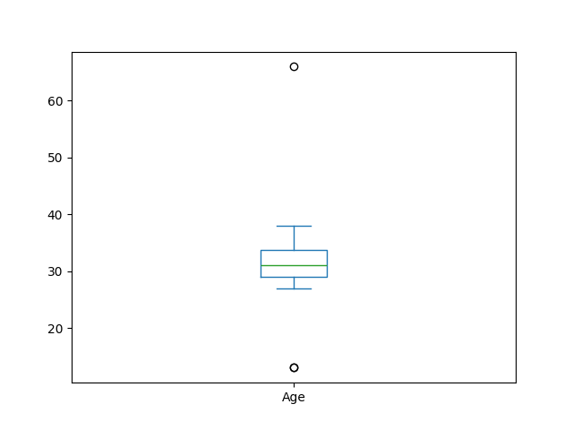

# Customer Data Cleaning Project

---

## Table of Contents

- [Scenario and Problem Statement](#scenario-and-problem-statement)
- [Dataset Description](#dataset-description)
- [Actions and Approach](#actions-and-approach)
- [Screenshots and Example](#screenshots-and-example)
- [Technologies Used](#technologies-used)
- [Project Structure](#project-structure)
- [Results and Insight](#results-and-insight)
- [Future Work](#future-work)
- [Contact Information](#contact-information)

---

## Scenario and Problem Statement

ABC Retail Corporation collected customer data from multiple sales channels in 2023. The raw dataset contains inconsistencies, missing values, formatting errors, and outliers, making it unreliable for analytics and business intelligence. The objective of this project is to produce an ETL (Extract, Transform, Load) pipeline that cleans, standardizes, and prepares the data for downstream analysis—enabling accurate customer segmentation, sales trend analysis, and targeted marketing.

---

## Dataset Description

- **Source:** `data/Raw_Data_Customer_2023.xlsx`
- **Records:** 23 customer entries
- **Fields:**
  - `ID`
  - `First Name`
  - `Last Name`
  - `Gender`
  - `Age`
  - `Birthday`
  - `Items Sold`
  - `Email`
  - `Phone Number`
- **Common Issues:**
  - Inconsistent text casing
  - Null values
  - Duplicates
  - Formatting errors (dates, phone numbers)
  - Outliers in numeric fields

---

## Actions and Approach

1. **Load Data:** Read the Excel file into a pandas DataFrame.
2. **Standardize Text:** Convert names and gender to uppercase, normalize gender values.
3. **Date Formatting:** Convert `Birthday` to pandas datetime format.
4. **Email Imputation:** Fill missing emails using a placeholder pattern based on name fields.
5. **Outlier Handling:** Detect and remove outliers in numeric columns using boxplot and domain knowledge.
6. **Missing Value Imputation:** Fill missing numeric values with the median.
7. **Remove Duplicates:** Ensure unique records.
8. **Export Cleaned Data:** Save the cleaned DataFrame to CSV for further use.

---

## Screenshots and Example

### Raw Data Preview (Before Cleaning)

| ID     | First Name | Last Name | Gender | Age | Birthday   | Items Sold | Email | Phone          |
| ------ | ---------- | --------- | ------ | --- | ---------- | ---------- | ----- | -------------- |
| 236450 | CHARLOTTE  | Reed      | Female | NaN | 1993-05-05 | NaN        | NaN   | +63 9376154820 |
| ...    | ...        | ...       | ...    | ... | ...        | ...        | ...   | ...            |

### Cleaned Data Preview (After Cleaning)

| ID     | First Name | Last Name | Gender | Age | Birthday   | Items Sold | Email              | Phone          |
| ------ | ---------- | --------- | ------ | --- | ---------- | ---------- | ------------------ | -------------- |
| 236450 | CHARLOTTE  | REED      | FEMALE | 30  | 1993-05-05 | 12.5       | liam.g@example.com | +63 9376154820 |
| ...    | ...        | ...       | ...    | ... | ...        | ...        | ...                | ...            |

### Example Graphs and Plots

Below are some of the visualizations used during the data cleaning process:

#### 1. Gender Distribution Bar Plot

Shows the count of customers by gender before standardization.


#### 2. Age Boxplot

Visualizes age distribution and highlights outliers.



#### 3. Items Sold Boxplot

Displays the distribution of items sold and identifies outliers (e.g., the 1000 value).


#### 4. Items Sold Histogram

Shows the frequency distribution of items sold after cleaning and imputation.


---

## Technologies Used

- Python 3.x
- pandas
- numpy
- matplotlib
- Jupyter Notebook

---

## Project Structure

```
raw-customer-data/
├── data/
│   ├── Raw_Data_Customer_2023.xlsx
│   └── Processed_Customer_2023.xslx
├── notebooks/
│   └── etl.ipynb
└── README.md
```

---

## Results and Insight

- Produced a clean, normalized dataset ready for analytics
- Standardized text, dates, and phone numbers
- Imputed missing values and handled outliers
- Improved data quality for downstream business intelligence

---

## Future Work

- Add automated unit tests for data validation
- Integrate with data visualization tools for reporting
- Explore advanced imputation and outlier detection techniques
- Automate the pipeline for regular data updates

---

## Contact Information

For questions or suggestions, please contact:

- **Email:** reynaldoiii.castillo@gmail.com
- **LinkedIn:** [Reynaldo III Castillo](https://www.linkedin.com/in/reynaldo-iii-castillo-975120303)

---
