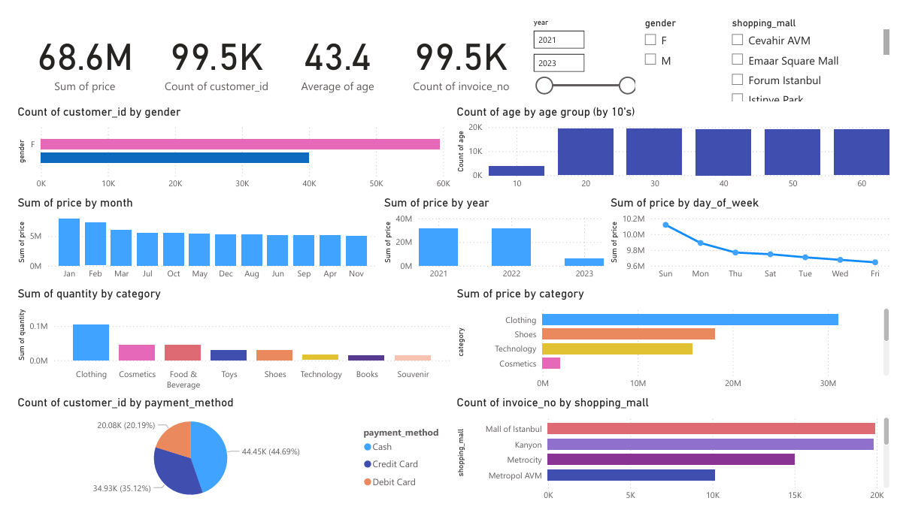

<!-- PROJECT LOGO -->
<p align="center">
  
</p>

# Customer Shopping Data ETL & Analysis

## Table of Contents

- [Scenario and Problem Statement](#scenario-and-problem-statement)
- [Dataset Description](#dataset-description)
- [Actions and Approach](#actions-and-approach)
- [Screenshots and Examples](#screenshots-and-examples)
- [Technologies Used](#technologies-used)
- [Project Structure](#project-structure)
- [Results and Insights](#results-and-insights)
- [Future Work](#future-work)
- [Acknowledgement](#acknowledgement)
- [Contact Information](#contact-information)

## Scenario and Problem Statement

A retail company wants to analyze customer shopping behavior to optimize marketing strategies and improve sales. The goal is to extract, clean, analyze, and store customer transaction data, then visualize key insights and load the results into a PostgreSQL database for further analytics.

## Dataset Description

- **Source:** `data/customer_shopping_data.csv`
- **Records:** 99,457 customer entries
- **Fields:**
  - `invoice_no`: Transaction identifier
  - `customer_id`: Unique customer identifier
  - `gender`: Gender of customer (may require standardization)
  - `age`: Age of customer
  - `category`: Product category
  - `quantity`: Number of items purchased
  - `price`: Price per item
  - `payment_method`: Payment method used
  - `invoice_date`: Date of transaction
  - `shopping_mall`: Location of purchase

## Actions and Approach

1. **Data Extraction:** Load CSV data using pandas.
2. **Exploratory Data Analysis (EDA):**
   - Check structure, duplicates, and nulls
   - Visualize distributions (gender, age, category, payment method, dates, shopping mall)
3. **Data Cleaning:**
   - Standardize data types for database compatibility
   - Handle inconsistencies (e.g., gender labels)
4. **Data Load:**
   - Store cleaned data in PostgreSQL using psycopg2
   - Table schema defined in notebook
   - Integrated in PowerBI and visualized

## Screenshots and Examples

Below are sample visualizations generated during EDA:

| Gender Distribution                             | Age Distribution                               | Category Distribution                |
| ----------------------------------------------- | ---------------------------------------------- | ------------------------------------ |
|  |  |  |

| Payment Method                             | Transactions by Year                             | Transactions by Month                             |
| ------------------------------------------ | ------------------------------------------------ | ------------------------------------------------- |
|  |  |  |

| Transactions by Day of Week                             | Transactions by Shopping Mall                             |
| ------------------------------------------------------- | --------------------------------------------------------- |
|  |  |

| Select Preview in DB                          |
| --------------------------------------------- |
|  |

## Technologies Used

- Python (pandas, matplotlib)
- Jupyter Notebook
- PostgreSQL
- psycopg2
- configparser

## Project Structure

```
├── config.ini                # Database configuration
├── README.md                 # Project documentation
├── requirements.txt          # Python dependencies
├── data/
│   └── customer_shopping_data.csv
├── images/
│   ├── raw_age_distribution_histogram.png
│   ├── raw_category_barplot.png
│   ├── raw_gender_distribution_barplot.png
│   ├── raw_payment_method_barplot.png
│   ├── raw_transactions_by_day_of_week_barplot.png
│   ├── raw_transactions_by_month_barplot.png
│   ├── raw_transactions_by_shopping_mall_barplot.png
│   └── raw_transactions_by_year_barplot.png
├── notebooks/
│   └── etl_customer_data.ipynb
```

## Results and Insights

- No duplicate or null values found in the dataset.
- Age and category distributions reveal customer demographics and popular products.
- Payment methods and shopping mall locations show customer preferences.
- Data successfully loaded into PostgreSQL for further analysis.

## Future Work

- Integrate more advanced analytics (e.g., customer segmentation, predictive modeling)
- Automate ETL pipeline
- Expand dataset with more features (e.g., loyalty, feedback)

## Acknowledgement

- The dataset used in this analysis was gathered from Kaggle. Titled Customer Shopping Dataset - Retail Sales Data and provided by Mehmet Tahir Aslan, it serves as the foundation for exploring customer shopping patterns and retail sales trends.
- Visualizations and ETL process developed in Jupyter Notebook.

## Contact Information

- **Author:** Reynaldo III Castillo
- **Email:** reynaldoiii.castillo@gmail.com
- **LinkedIn:** [linkedin.com/in/reynaldo-iii-castillo](https://www.linkedin.com/in/reynaldo-iii-castillo-975120303)
