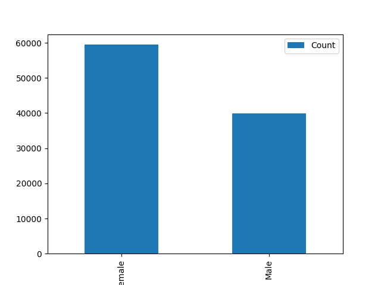

<!-- PROJECT LOGO -->
<p align="center">
  
</p>

# Customer Shopping Data ETL & Analysis

## Table of Contents

- [Scenario and Problem Statement](#scenario-and-problem-statement)
- [Dataset Description](#dataset-description)
- [Actions and Approach](#actions-and-approach)
- [Screenshots and Examples](#screenshots-and-examples)
- [Technologies Used](#technologies-used)
- [Project Structure](#project-structure)
- [Results and Insights](#results-and-insights)
- [Future Work](#future-work)
- [Acknowledgement](#acknowledgement)
- [Contact Information](#contact-information)

## Scenario and Problem Statement

A retail company wants to analyze customer shopping behavior to optimize marketing strategies and improve sales. The goal is to extract, clean, analyze, and store customer transaction data, then visualize key insights and load the results into a PostgreSQL database for further analytics.

## Dataset Description

- **Source:** `data/customer_shopping_data.csv`
- **Records:** 99,457 customer entries
- **Fields:**
  - `invoice_no`: Transaction identifier
  - `customer_id`: Unique customer identifier
  - `gender`: Gender of customer (may require standardization)
  - `age`: Age of customer
  - `category`: Product category
  - `quantity`: Number of items purchased
  - `price`: Price per item
  - `payment_method`: Payment method used
  - `invoice_date`: Date of transaction
  - `shopping_mall`: Location of purchase

## Actions and Approach

1. **Data Extraction:** Load CSV data using pandas.
2. **Exploratory Data Analysis (EDA):**
   - Check structure, duplicates, and nulls
   - Visualize distributions (gender, age, category, payment method, dates, shopping mall)
3. **Data Cleaning:**
   - Standardize data types for database compatibility
   - Handle inconsistencies (e.g., gender labels)
4. **Data Load:**
   - Store cleaned data in PostgreSQL using psycopg2
   - Table schema defined in notebook
   - Integrated in PowerBI and visualized

## Screenshots and Examples

Below are sample visualizations generated during EDA:

| Gender Distribution                             | Age Distribution                               | Category Distribution                |
| ----------------------------------------------- | ---------------------------------------------- | ------------------------------------ |
|  |  |  |

| Payment Method                             | Transactions by Year                             | Transactions by Month                             |
| ------------------------------------------ | ------------------------------------------------ | ------------------------------------------------- |
|  |  |  |

| Transactions by Day of Week                             | Transactions by Shopping Mall                             |
| ------------------------------------------------------- | --------------------------------------------------------- |
|  |  |

| Select Preview in DB                          |
| --------------------------------------------- |
|  |

| Dashboard Preview in PowerBI                   |
| ---------------------------------------------- |
|  |

## Technologies Used

- Python (pandas, matplotlib)
- Jupyter Notebook
- PostgreSQL
- psycopg2
- configparser

## Project Structure

```
├── config.ini                # Database configuration
├── README.md                 # Project documentation
├── requirements.txt          # Python dependencies
├── data/
│   └── customer_shopping_data.csv
├── images/
│   ├── raw_age_distribution_histogram.png
│   ├── raw_category_barplot.png
│   ├── raw_gender_distribution_barplot.png
│   ├── raw_payment_method_barplot.png
│   ├── raw_transactions_by_day_of_week_barplot.png
│   ├── raw_transactions_by_month_barplot.png
│   ├── raw_transactions_by_shopping_mall_barplot.png
│   └── raw_transactions_by_year_barplot.png
│   └── retail_sales_dashboard_preview.png
│   └── select_in_postgresql_database.png
├── notebooks/
│   └── etl_customer_data.ipynb
├── powerbi/
│   └── retail_sales_dashboard.pbix
```

## Results and Insights

### 1. Customer Demographics

- **Gender split**: More female customers than male -> marketing campaigns could target women more, especially in high-value categories like clothing and cosmetics.
- **Age distribution**: Customers are spread across different age groups, but the **20–60 age group** likely dominates. Younger and middle-aged adults are the primary shoppers.

---

### 2. Sales Trends Over Time

- **By month**: Sales peak in **January** (possibly holiday/clearance shopping) and then gradually drop across the year. Suggests **seasonality** – marketing should push sales campaigns during low months.
- **By year**: 2021 and 2022 show strong sales, while 2023 has a noticeable drop -> indicates a decline in recent performance, worth investigating (economic conditions, competition, or fewer promotions).
- **By day of week**: Sales are fairly balanced, but Sun seem higher → customers shop more on restdays, so promotions and staffing should align with that.

---

### 3. Product Category Insights

- **Clothing** dominates in both _quantity_ and _revenue_ → it’s the biggest driver of business.
- **Shoes and Technology** also contribute significantly in revenue but not as much in quantity → higher-ticket items.
- **Cosmetics, Food, Toys, Books, Souvenirs** are minor categories → could either be cross-sell opportunities or areas for growth campaigns.

---

### 4. Payment Behavior

- **Cash** is the most common payment method (\~45%), followed by Credit Card (\~35%) and Debit Card (\~20%).
- High cash dependency might suggest either cultural preference or limited card penetration. Offering **digital wallet/QR pay** could improve customer convenience.

---

### 5. Shopping Mall Performance

- **Mall of Istanbul, Kanyon, Metrocity** are the top-performing malls by invoice count.
- Other malls (Metropol AVM, Zorlu Center, etc.) lag behind, which may indicate:

  - Lower foot traffic,
  - Less effective mall marketing, or
  - Higher competition.

- Expansion efforts or targeted promotions may be more effective in top malls.

---

### Key Business Takeaways

1. **Target female customers aged 20–60** → they are the core demographic.
2. **Clothing drives revenue** → focus on maintaining and expanding this category, while exploring ways to boost underperforming ones.
3. **Sales are seasonal** → leverage January spikes, but address mid-year drops with promotions.
4. **Weekend shopping is stronger** → schedule promotions/events around Fri–Sun.
5. **Cash dominates payments** → opportunity to push digital payment adoption.
6. **Top malls bring most revenue** → double down marketing and partnerships with Mall of Istanbul, Kanyon, Metrocity.

---

## Future Work

- Integrate more advanced analytics (e.g., customer segmentation, predictive modeling)
- Automate ETL pipeline
- Expand dataset with more features (e.g., loyalty, feedback)

## Acknowledgement

- The dataset used in this analysis was gathered from [Kaggle](https://www.kaggle.com/datasets/mehmettahiraslan/customer-shopping-dataset/data). Titled Customer Shopping Dataset - Retail Sales Data and provided by Mehmet Tahir Aslan, it serves as the foundation for exploring customer shopping patterns and retail sales trends.
- Visualizations and ETL process developed in Jupyter Notebook.

## Contact Information

- **Author:** Reynaldo III Castillo
- **Email:** reynaldoiii.castillo@gmail.com
- **LinkedIn:** [linkedin.com/in/reynaldo-iii-castillo](https://www.linkedin.com/in/reynaldo-iii-castillo-975120303)
